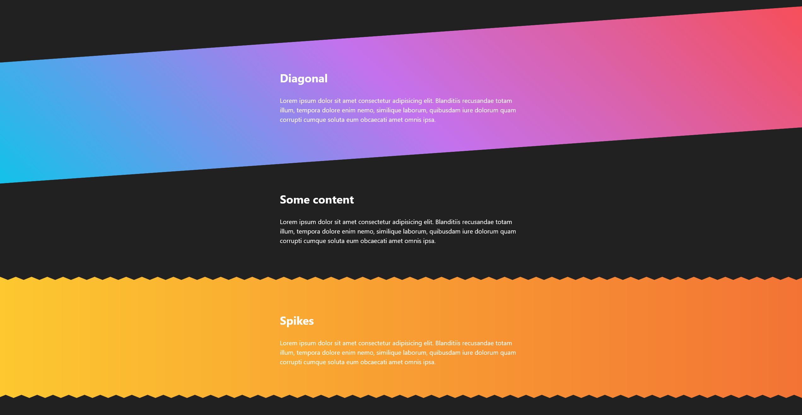
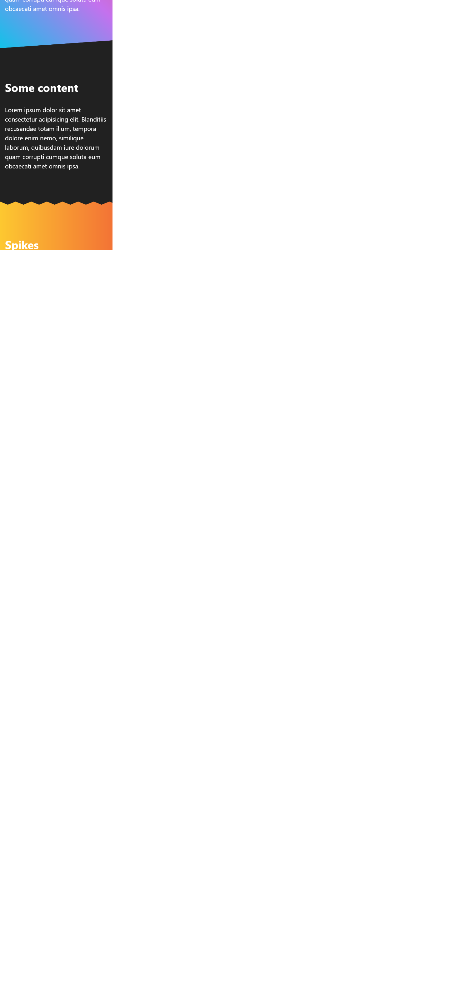

# Fancy Sections

> A demonstration of styled sections and section borders.
> Live demo [_here_](http://david-abell.github.io/fancy-sections).

## Table of Contents

- [Overview](#overview)
  - [Project description](#project-description)
  - [Features](#features)
  - [Screenshots](#screenshots)
- [My process](#my-process)
  - [Built With](#built-with)
  - [What I learned](#what-i-learned)
  - [Continued development](#continued-development)
  - [Useful resources](#useful-resources)
- [Instructions](#instructions)
  - [Setup](#setup)
  - [Usage](#usage)
- [Acknowledgements](#acknowledgements)

## Overview

### Project Description

- This is a simple project demo of sections with triangular, curved, and multiple layered bounderies

### Features

- Includes sections styled with Diagonal, spiked, waves, and curved boundaries, as well as a bonuse stacked curve background

### Screenshots



<details>

  <summary>Click here to show mobile screenshot</summary>



</details>

## My Process

### Built With

- Semantic HTML5 markup
- CSS custom properties
- linear gradients
- svg masks

### Continued Development

### What I learned

- I had not used css mask image before, for example:

```css
.spikes::before,
.spikes::after {
  content: "";
  position: absolute;
  width: 100%;
  height: var(--spike-height);
  background: var(--body-bg);
  -webkit-mask-image: url("assets/triangle.svg");
  -webkit-mask-size: var(--spike-width) var(--spike-height);
  mask-image: url("assets/triangle.svg");
  mask-size: var(--spike-width) var(--spike-height);
}
```

## Instructions

### Setup

No setup required.

### Usage

Open index.html with your favourite live server.

## Useful resources

- [css-generators.com/](https://css-generators.com/custom-borders/) - Generator for Zig-Zag, Rounded, and Wavy borders
- [shapedivider.app](https://www.shapedivider.app) - Custom Shape Dividers.
- [haikei.app](https://app.haikei.app) - Generate unique SVG design assets.

## Acknowledgements

- [Spice up your site | Easy waves, angles, & other creative shapes with CSS](https://youtu.be/hWGgw1K-i8Y) - Keven Powell
- [Build a Curvaceous Homepage // Wavy Background Tutorial with SVG & CSS](https://youtu.be/lPJVi797Uy0) - Keven Powell
